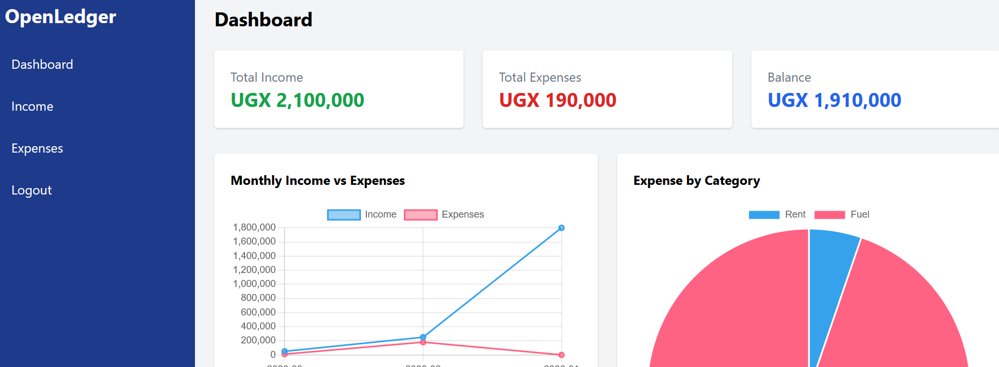
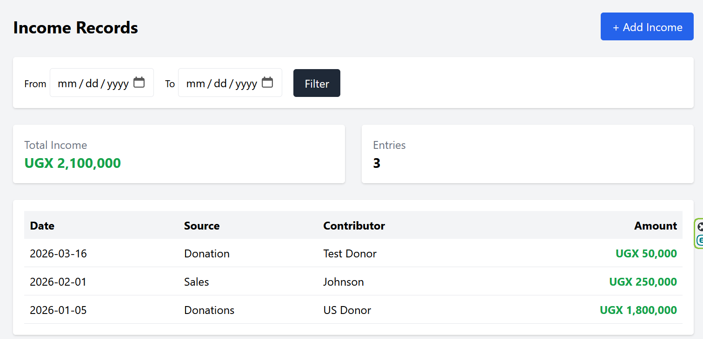
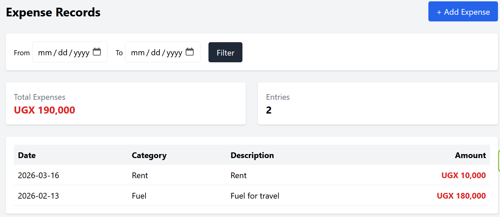
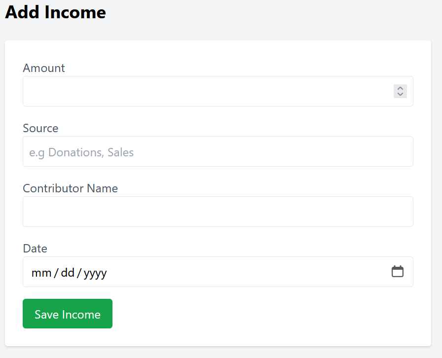

# 💼 OpenLedger Lite

> A simple, elegant, and open-source financial tracking system for individuals, NGOs, and small teams.


---

## 🌍 Overview

**OpenLedger Lite** is a lightweight financial management system designed to help users:

* 💰 Track income
* 💸 Manage expenses
* 📊 Visualize financial performance

Built with simplicity and usability in mind, it is ideal for:

* Individuals managing personal finances
* NGOs tracking funds and donations
* Small businesses monitoring cash flow
* Community groups and savings clubs

---

## 🖼️ Screenshots

### 📊 Dashboard



---

### 💰 Income Management



---

### 💸 Expense Management



---

### ➕ Add Income



---

## ✨ Features

### 📊 Dashboard

* Financial summary (Income, Expenses, Balance)
* Monthly trends (Income vs Expenses)
* Expense category breakdown (Pie Chart)

### 💰 Income Management

* Add income entries
* Dynamic source creation (auto-add new sources)
* Contributor tracking
* Date filtering
* Summary cards

### 💸 Expense Management

* Add expenses
* Dynamic category creation
* Description support
* Date filtering
* Summary cards

### 🔐 Authentication

* Simple login system
* Secure session handling
* Logout functionality

### 📁 Clean Architecture

* Organized folder structure
* PDO-based database connection
* Modular and extendable

---

## ⚙️ Installation

### 1. Clone the repository

```bash
git clone https://github.com/kettalevi/openledger-lite.git
cd openledger-lite
```

---

### 2. Setup Database

Create database:

```
openledger_lite
```

Import:

```
database.sql
```

---

### 3. Configure Database

Edit:

```
includes/config.php
```

```php
define('DB_HOST', 'localhost');
define('DB_NAME', 'openledger_lite');
define('DB_USER', 'root');
define('DB_PASS', '');
```

---

### 4. Create First User

Run once:

```php
<?php
require 'includes/db.php';

$password = password_hash("admin123", PASSWORD_DEFAULT);

$conn->prepare("INSERT INTO users (name, email, password) VALUES (?, ?, ?)")
     ->execute(["Admin", "admin@test.com", $password]);
```

---

### 5. Run the Project

Open:

```
http://localhost/openledger-lite
```

Login:

* Email: [admin@test.com](mailto:admin@test.com)
* Password: admin123

---

## 🧠 Project Structure

```
openledger-lite/
│
├── auth/
├── dashboard/
├── income/
├── expenses/
├── includes/
├── assets/
│   └── screenshots/
├── database.sql
└── README.md
```

---

## 🚀 Roadmap

* 📤 CSV Export
* 📄 PDF Reports
* 🏦 Bank Account Integration
* 👥 Multi-user roles
* 📊 Advanced analytics
* 🌐 API support

---

## 💡 Why OpenLedger Lite?

Most financial tools are either:

* Too complex
* Too expensive
* Too rigid

**OpenLedger Lite solves this by being:**

* Simple
* Flexible
* Open-source
* Developer-friendly

---

## 🤝 Contributing

Contributions are welcome!

* Fork the repo
* Create a feature branch
* Submit a pull request

---

## 📜 License

This project is licensed under the MIT License.

---

## 👨‍💻 Author

**Martin Levi K.A.**
Systems Developer | IT Solutions Architect | Technical Author

Passionate about building practical systems that solve real-world problems across Africa and beyond.

---

## 🌟 Support

If you find this project useful:

⭐ Star the repository
🍴 Fork it
📢 Share it

---

## 🔥 Commercial Version

A premium version with advanced features (multi-user, reporting, integrations) is under development.

Stay tuned 🚀
